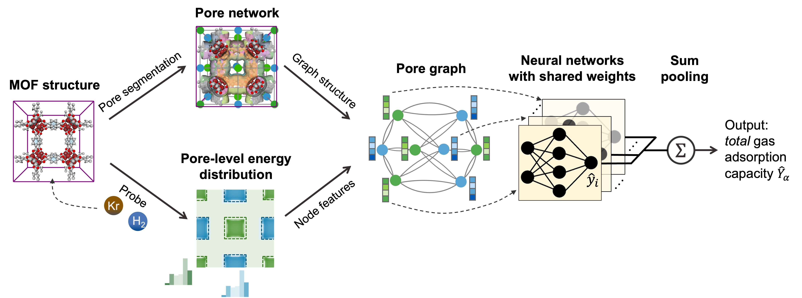

# PoroNet
PoroNet is an inherently interpretable pore graph neural network for predicting gas adsorption capacity in metal-organic frameworks (MOFs). Its interpretability allows the extraction of contributions of individual pores to the total adsorption. PoroNet is constructed on top of pore graphs, which can be generated using code in this repo. The pore graph generation and pore-level energy histogram features will be later incorporated into an open-source Python package, Mofography (unpublished). Stay tuned!  

## Instructions
This repository consists of:
1. "poronet_functions": Functions used in PoroNet.
2. "Download_Tobacco_Database": Download MOF structures from the Tobacco database through MOFXDB (mof.tech.northwestern.edu) database.
3. "Pore_Graph_Generation": Generate pore graphs for chosen MOFs.
4. "Pore_Labels_Extraction": Extract pore-level labels from RASPA2 Movie files.
5. "PoreNet&PoroNet-Base": Illustrations of PoroNet and PoroNet-Base for predicting H2 adsorption at 160 K/5 bar.
6. "Cavity_Size_Distribution_Calculation": Calculation of the cavity size distribution .
7. "Pore_Surface_Area_Calculation":Calcultion of the surface area of pores.
8. "Example_GCMC_input": Example RASPA2 simulation input files for H2 adsorption in MOFs.
9. "GCMC_output": Results of GCMC simulation for H2 adsorption in selected MOFs and pores at cryogenic conditions (160 K/5 bar, 77 K/100 bar) and room temperature conditions (298 K/5 bar, 298 K/100 bar).

## Reference
Zheng C, Gopalan A, Shi K. PoroNet: An Inherently Interpretable Pore Graph Neural Network for Prediction of Gas Adsorption in Metal-Organic Frameworks. ChemRxiv. 2025; doi:10.26434/chemrxiv-2025-gc17t. 
https://chemrxiv.org/engage/chemrxiv/article-details/68b1d29ea94eede1546d3853
